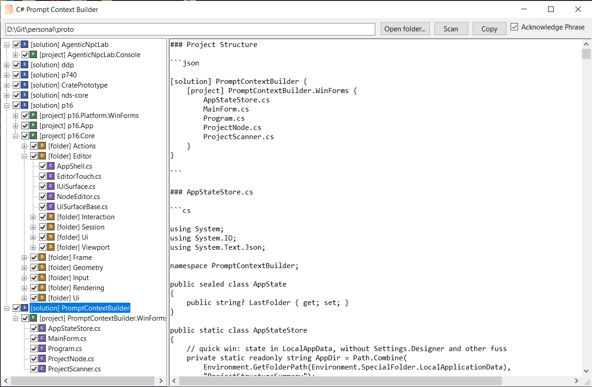

# Prompt context builder for C# projects

A small Windows desktop utility for quickly preparing C# project context for chatbots, AI assistants, code reviews, and debugging conversations.

The idea is simple: select a C# solution or project, choose which files to include, and copy a clean Markdown snapshot of the project structure and source code.

I originally wrote this prototype for myself about half a year ago. It turned out to be useful enough that I now use it almost every time I work with code, so I decided to share it publicly.

It is especially useful if you work with AI assistants in a manual, step-by-step way: you stay in control, review every change yourself, and use the chatbot as a coding partner rather than fully automating the process. In that workflow, one of the most annoying parts is giving the assistant the right code context without dumping the whole repository.

## Why

When working with ChatGPT, Claude, Copilot Chat, or similar tools, the annoying part is often not the question itself.

It is preparing the context.

You usually need to:

- show the project structure
- include several related files
- exclude unrelated projects or generated files
- avoid pasting too much noise
- stop the assistant from immediately analyzing before you finish giving instructions

This tool is built for that workflow.

## Features

- Scan folders for C# `.sln` and `.csproj` files
- Show solutions, projects, folders, and `.cs` files in a tree
- Include or exclude whole projects, folders, or individual files
- Generate a Markdown report with:
  - project structure
  - selected source files
- Copy the generated context to clipboard
- Optional acknowledgement phrase:
  - `Acknowledge and wait for further instructions:`
- Remembers the last opened folder
- Skips common build/tooling folders:
  - `bin`
  - `obj`
  - `.vs`
  - `.git`
  - `.idea`
  - `.vscode`
  - `packages`

## Typical workflow

1. Open the app.
2. Choose a folder containing C# solutions/projects.
3. Click **Scan**.
4. Select a solution, project, folder, or file.
5. Use checkboxes to include only the files you want.
6. Keep **Acknowledge Phrase** enabled if you want the chatbot to wait.
7. Click **Copy**.
8. Paste into your chatbot.
9. Send the actual task or instruction after that.

The acknowledgement phrase helps prevent the assistant from immediately writing a long analysis before you have finished providing context.

## Example output

````md
Acknowledge and wait for further instructions:

### Project Structure

```json
[solution] ProjectStructureSummary {
    [project] ProjectStructureSummary {
        AppStateStore.cs
        MainForm.cs
        Program.cs
        ProjectNode.cs
        ProjectScanner.cs
    }
}
```

### MainForm.cs

```cs
// source code...
```

### ProjectScanner.cs

```cs
// source code...
```
`````

## Use cases

- Preparing code context for ChatGPT, Claude, or other coding assistants
    
- Asking an assistant to review several related files
    
- Debugging with enough context, but without dumping the whole repository
    
- Sharing a compact project snapshot in an issue or discussion
    
- Quickly giving another developer a readable overview of a small C# project
    


## Screenshot



## License

MIT License

## Author

Elliot Rei aka railegh
